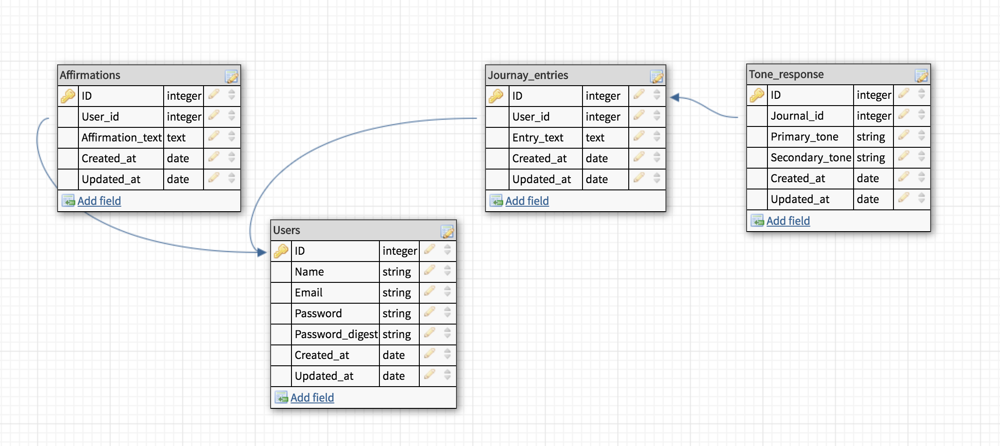

# MoodBoard API
[](https://waffle.io/tmaria17/mood_board_be)

[](https://travis-ci.org/tmaria17/mood_board_be)

[](https://codeclimate.com/github/tmaria17/mood_board_be/maintainability)

MoodBoard API is a RESTful API built in Rails 5.2.

Please review the below instructions to get mood_board_be up and running on your local machine for development and testing purposes.

The base URL for the API is https://mood-board-be.herokuapp.com/. <br>
Visit the deployed app here: https://moodboard-1808.herokuapp.com/.<br>
Visit the front end repo  here: https://github.com/ashtonkbailey/MoodBoard-FE.

## Table of Contents

* Schema
* Endpoint Explanation
* Prerequisites
* Testing Dependencies
* APIs consumed (keys required)
* Additional Gems
* Installation
* Running the Test Suite

## Schema


## Endpoint Explanation

Base URL: https://mood-board-be.herokuapp.com/

All API requests must have the following headers:
```
Content-Type: application/json
Accept: application/json
```

### Endpoint: `GET api/v1/users/:user_id/journal_entries?date=today`

This endpoint is specifically for the CURRENT DATE only. It returns either a new, blank daily journal entry for the user or an existing journal entry started by the user earlier for that day. Only one journal entry exists per day, per user.

Request Requirements: None

JSON Response (for existing journal entry):
```
{
"data": {
  "id": "8",
  "type": "journal_entry",
  "attributes": {
    "created_at": "2019-02-18T00:00:00.000Z",
    "entry_text": "Journal entry text here... I am happy",
    "tones": {
      "id": 8,
      "primary_tone": "joy",
      "secondary_tone": null,
      "journal_entry_id": 8,
      "created_at": "2019-02-18T00:20:41.120Z",
      "updated_at": "2019-02-18T00:20:41.120Z",
      "primary_score": "0.747745",
      "secondary_score": null
    }
  }
 }
}
```
JSON Response (for new, blank journal entry):
```
{
"data": {
  "id": "8",
  "type": "journal_entry",
  "attributes": {
    "created_at": "2019-02-18T00:00:00.000Z",
    "entry_text": null,
    "tones": null
  }
 }
}
```

### Endpoint `PATCH /api/v1/users/:user_id/journal_entries?date=today`

This endpoint updates the user's current day's journal entry with the entry text submitted as JSON in the request body. The same formatted JSON response is returned as with the `GET /api/v1/users/:user_id/journal_entries?date=today`. (Journal entries from dates other than the current day are NOT able to be updated.)

Request Requirements:
The request must contain a request body in the following format.
`{ "journal_entry": { "entry_text": "<USERS UPDATED JOURNAL ENTRY TEXT HERE>" } }`

JSON Response (assumes request with `"I am feeling sad today."` submitted):
```
{
    "data": {
        "id": "9",
        "type": "journal_entry",
        "attributes": {
            "created_at": "2019-02-19T00:00:00.000Z",
            "entry_text": "I am feeling sad today.",
            "tones": {
                "id": 9,
                "primary_tone": "sadness",
                "secondary_tone": null,
                "journal_entry_id": 9,
                "created_at": "2019-02-19T17:29:51.025Z",
                "updated_at": "2019-02-19T17:29:51.025Z",
                "primary_score": "0.945576",
                "secondary_score": null
            }
        }
    }
}
```

### Endpoint `GET /api/v1/users/:user_id/calendar?date=YYYY-MM-DD`

This endpoints returns a user's journal entry, tone response, and any affirmations created for a specified date. The date parameter in the URL is formatted as `2019-02-16`.

Request Requirements:
The date requested in the URL must have an existing journal entry created on that date to return a valid JSON response.

JSON Response:
```
{
    "data": {
        "id": "2019-02-19 00:59:26 +0000",
        "type": "calendar_day",
        "attributes": {
            "date": "2019-02-16",
            "journal_entry_text": "I guess it was inevitable, but I have had some problems with my book and the website. In fact a few days ago, I was very depressed. I worked and continue to work very hard on my writing, but I dont think it means anything important. When I finally recieved a copy of the book in the mail it was of poor quality. Then there were problems with pricing. I just cannot justify charging too much for my book. Then there were problems with the website. Combine all that with the frustration of not getting work yet, and I was a mess! The good news is I contacted my publisher and explained everything to him. Hopefully my book will be a success.",
            "primary_tone": "sadness",
            "primary_score": "0.57",
            "affirmations": [
                {
                    "affirmation_text": "I am worthy."
                }
            ]
        }
    }
}
```

### Endpoint `GET /api/v1/users/:user_id/affirmations?date=YYYY-MM`

This endpoint returns all the affirmations a user created during a queried month. The date parameter in the URL is formatted as `2019-01` representing January 2019.

Request Requirements: None

JSON Response:
```
{
    "data": {
        "id": "2019-02-19 22:46:29 +0000",
        "type": "affirmation_wrapper",
        "attributes": {
            "date": "2019-02",
            "affirmations": [
                {
                    "date": "2019-02-12",
                    "affirmation_text": "I am beautiful.",
                    "tone": "confident"
                },
                {
                    "date": "2019-02-18",
                    "affirmation_text": "I am kind.",
                    "tone": "anger"
                },
                {
                    "date": "2019-02-17",
                    "affirmation_text": "I am smart.",
                    "tone": "sadness"
                },
                {
                    "date": "2019-02-16",
                    "affirmation_text": "You can do this.",
                    "tone": "tentative"
                },
                {
                    "date": "2019-02-15",
                    "affirmation_text": "Believe in yourself.",
                    "tone": "joy"
                },
                {
                    "date": "2019-02-14",
                    "affirmation_text": "You are loved.",
                    "tone": "confident"
                },
                {
                    "date": "2019-02-13",
                    "affirmation_text": "I am important.",
                    "tone": "analytical"
                },
                {
                    "date": "2019-02-12",
                    "affirmation_text": "I am worthy.",
                    "tone": "confident"
                }
            ]
        }
    }
}
```

### Endpoint: `POST /api/v1/users/:user_id/affirmations?date=today`

This endpoint posts a new affirmation to the database for the user on the current date.

Request Requirements:
The request must contain a request body in the following format.
`{ "affirmation": { "affirmation_text": "<AFFIRMATION TEXT HERE>" } }`

If the affirmation is successfully saved, the server will return a 201 (created) status, or a 400 status if the POST is not successful.

### Endpoint: `GET /api/v1/users/1/tone_responses?date=YYYY-MM`

This endpoint returns the primary tone and date for all the tone_responses in a queried month (YYYY-MM).

Request Requirements: None

JSON Response:
```
{
    "data": [
        {
            "id": "2019-02-12",
            "type": "tone_response",
            "attributes": {
                "primary_tone": "confident"
            }
        },
        {
            "id": "2019-02-18",
            "type": "tone_response",
            "attributes": {
                "primary_tone": "anger"
            }
        },
        {
            "id": "2019-02-17",
            "type": "tone_response",
            "attributes": {
                "primary_tone": "sadness"
            }
        },
        {
            "id": "2019-02-16",
            "type": "tone_response",
            "attributes": {
                "primary_tone": "tentative"
            }
        },
        {
            "id": "2019-02-15",
            "type": "tone_response",
            "attributes": {
                "primary_tone": "joy"
            }
        },
        {
            "id": "2019-02-14",
            "type": "tone_response",
            "attributes": {
                "primary_tone": "confident"
            }
        },
        {
            "id": "2019-02-13",
            "type": "tone_response",
            "attributes": {
                "primary_tone": "analytical"
            }
        },
        {
            "id": "2019-02-11",
            "type": "tone_response",
            "attributes": {
                "primary_tone": "fear"
            }
        },
        {
            "id": "2019-02-19",
            "type": "tone_response",
            "attributes": {
                "primary_tone": "sadness"
            }
        }
    ]
}
```

## Prerequisites

* Ruby v. 2.4
* Rails v. 5.2
* Puma v. 3.7
* PG v. 1.1.3

## APIs Consumed (keys required) / External Services
[Watson]([Watson](https://www.javascript.com/)


## Testing Dependencies

* Rspec-Rails
* Capybara
* Factory_bot_rails
* Webmock
* VCR
* Faraday

## Additional Gems

* Bcrypt
* Fast_jsonapi
* Shoulda-matchers
* Database_cleaner
* Figaro

## Installation
Clone down this repository, change into the root directory and run:

`bundle`

To setup the database necessary for this API, run the following commands:

`bundle exec rake db:create`

`bundle exec rake db:migrate`

## Running the Test Suite

Run `bundle exec rspec` to run the full test suite.

Run `bundle exec rspec <TEST FILE PATH>` to run a specific test
